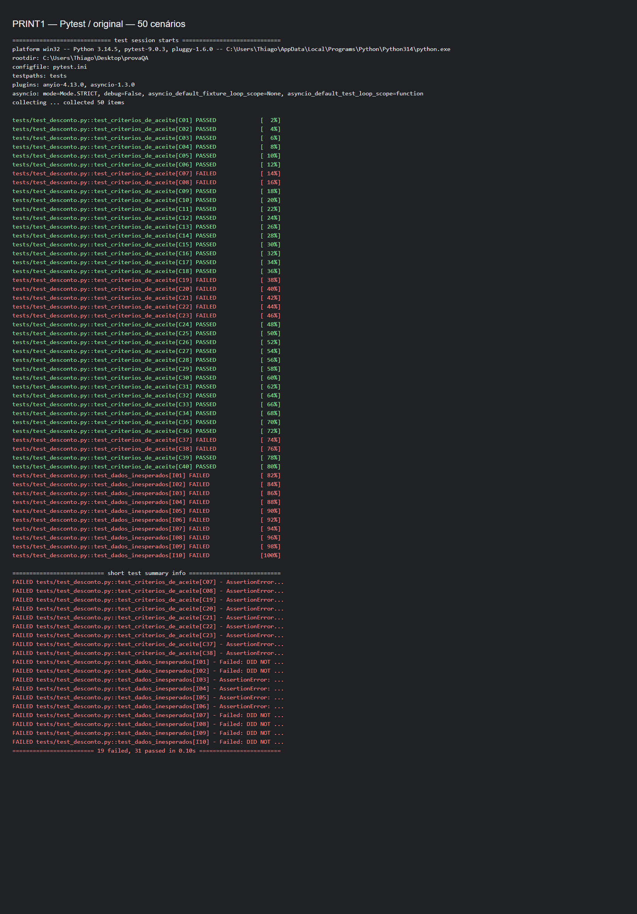
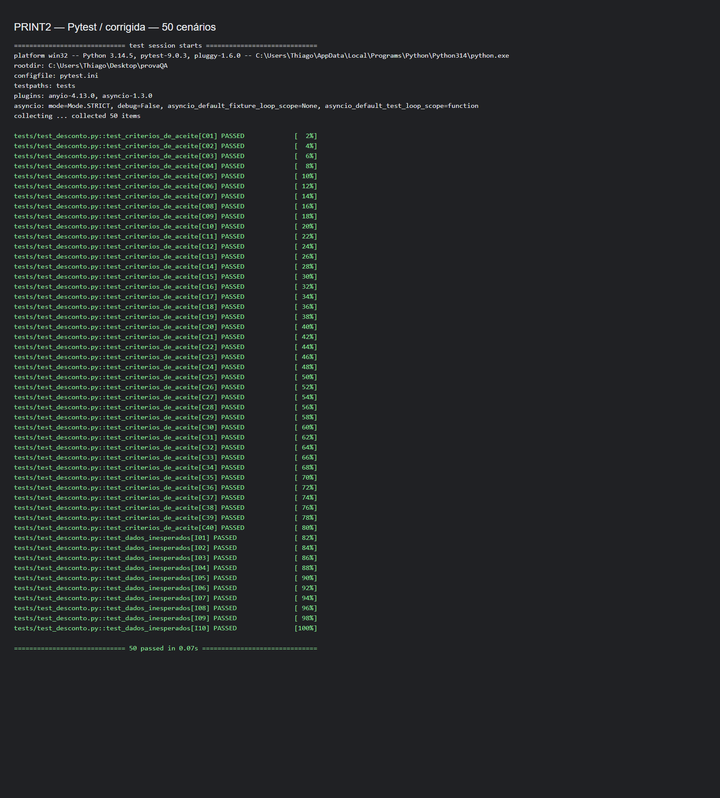

# Auditoria de descontos — Tech UniDiasUp

Entrega: [thiagoplb/provaQA](https://github.com/thiagoplb/provaQA).

A função retorna o desconto em reais. A mesma suíte de 50 testes roda no código original e no corrigido: **19 falhas e 31 sucessos antes; 50 sucessos depois**.

## Preencher o formulário

- Código corrigido: copie [desconto.py](desconto.py).
- Todos os cenários: copie [CENARIOS_RESUMIDOS.txt](CENARIOS_RESUMIDOS.txt), com os 40 cenários de desconto e os 10 de dados inesperados efetivamente testados.
- Bugs e escolha dos valores: copie [BUGS_ENCONTRADOS.txt](BUGS_ENCONTRADOS.txt).
- PRINT1: anexe [PRINT1.png](evidencias/PRINT1.png).
- PRINT2: anexe [PRINT2.png](evidencias/PRINT2.png).
- Link do GitHub: `https://github.com/thiagoplb/provaQA`.

## Executar os testes

```powershell
python -m pip install -r requirements.txt
python -m pytest -p no:cacheprovider -v
python -m pytest -p no:cacheprovider -v --implementacao original
```

A última execução deve falhar: usa os mesmos cenários e resultados esperados no código original preservado em `desconto_original.py`.

## Dados inesperados

Como os critérios originais não definiam esses casos, foram adotadas regras adicionais: compras devem ser `int` ou `float`, não negativas. Não há conversão automática de texto para número. Categorias devem ser texto, COMUM ou VIP, ignorando maiúsculas e espaços nas extremidades. Tipos inválidos geram `TypeError`; valores inválidos geram `ValueError`. Os testes verificam a exceção e a mensagem.

O arredondamento `round(..., 2)` original foi mantido.

Os dados inesperados testados se limitam a entradas plausíveis nos campos: valores negativos, textos, campos vazios, espaços e categorias inválidas. A função recebe o valor da compra já numérico; a conversão do texto digitado no formulário pertence à interface.

## Evidências

Os PNGs são capturas no navegador das saídas reais do Pytest. As páginas HTML usadas na captura são temporárias e não fazem parte da entrega.




